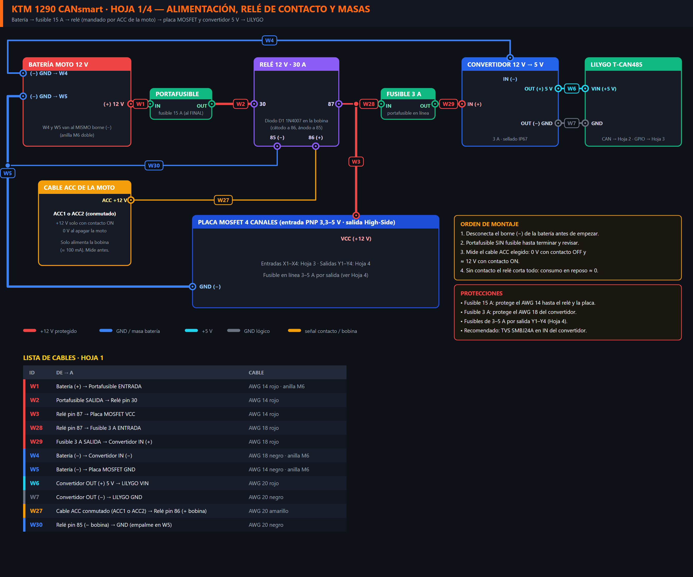
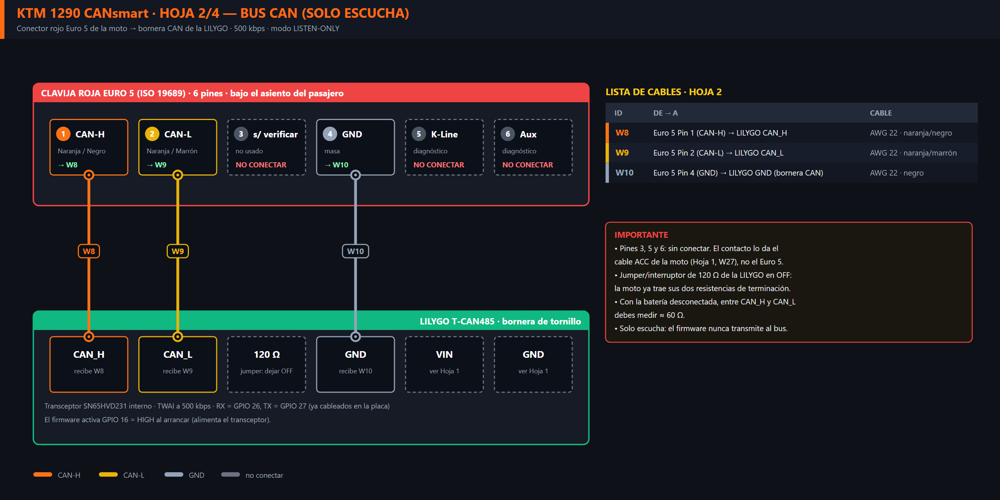
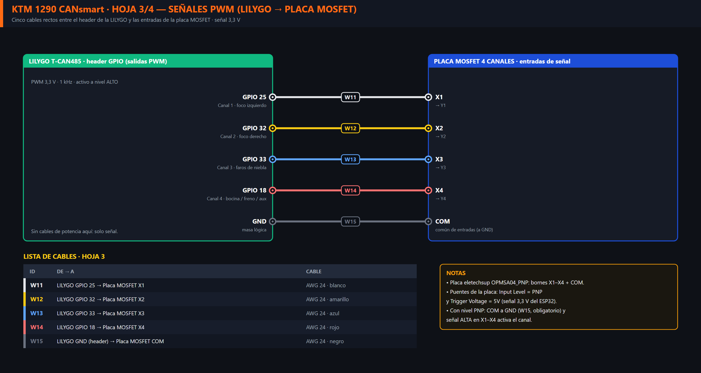
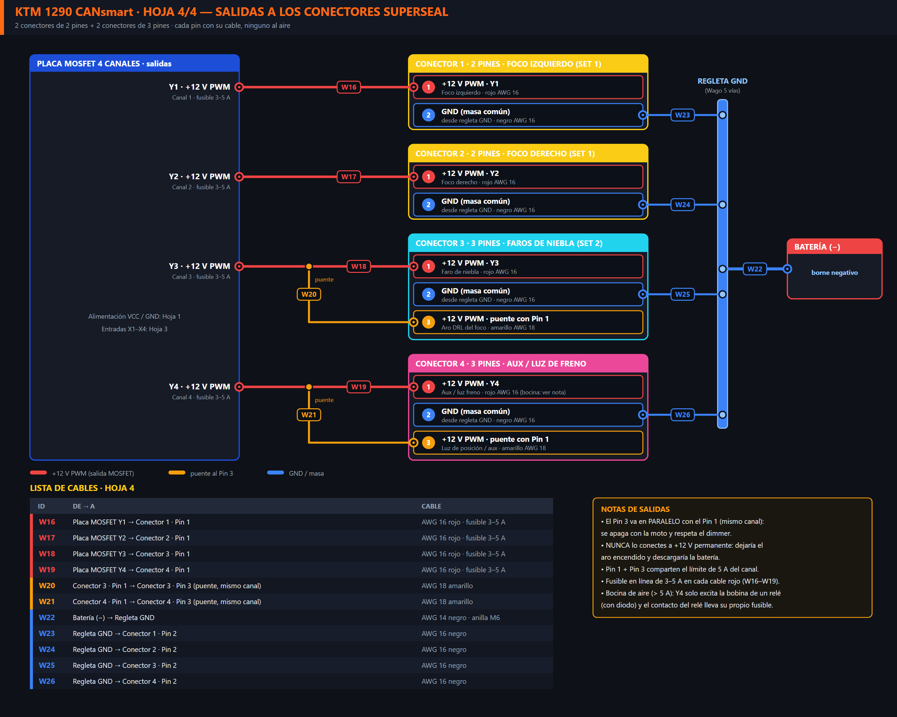
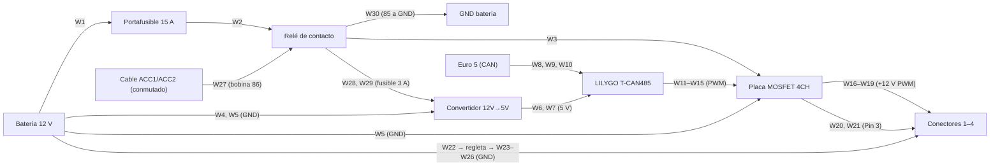

# ⚡ Esquema Eléctrico y Diagrama de Conexiones: KTM 1290 CANsmart

Guía de cableado de la **KTM 1290 Super Adventure S (2024 Euro 5)** con los materiales de [`ListaCompras.md`](ListaCompras.md).

El esquema está dividido en **4 hojas**. Cada hoja es una etapa del montaje, **cada cable tiene un ID (W1…W30)** que es el mismo en la imagen y en las tablas de este documento, y ningún cable se cruza ni se solapa con otro.

> 🖼️ Cada hoja existe en **PNG** (para ver/imprimir) y en **SVG** (el mismo dibujo en vectorial, ampliable sin perder calidad) dentro de [`hardware/diagramas/`](hardware/diagramas/). Son idénticos: usa el que prefieras. Se regeneran con `python hardware/generate_diagrams.py`.

| Hoja | Qué conectas | Cables |
| :---: | :--- | :---: |
| [1 · Alimentación](#hoja-1--alimentación-relé-de-contacto-y-masas) | Batería → fusible 15 A → relé de contacto (bobina por ACC de la moto) → placa MOSFET y convertidor 5 V → LILYGO | W1–W7, W27–W30 |
| [2 · Bus CAN](#hoja-2--bus-can-solo-escucha) | Conector rojo Euro 5 → LILYGO (solo CAN-H, CAN-L y GND) | W8–W10 |
| [3 · Señales PWM](#hoja-3--señales-pwm-lilygo--placa-mosfet) | LILYGO → entradas de la placa MOSFET | W11–W15 |
| [4 · Salidas](#hoja-4--salidas-a-los-conectores-superseal) | Placa MOSFET → 4 conectores Superseal + regleta GND | W16–W26 |

> ⚠️ **Compra pendiente:** la regleta de masa de la Hoja 4 se hace con un conector de palanca tipo **Wago 221-415 (5 vías)**. Está añadida a [`ListaCompras.md`](ListaCompras.md).

---

## Hoja 1 · Alimentación, relé de contacto y masas

| ID | De → A | Cable |
| :---: | :--- | :--- |
| **W1** | Batería (+) → Portafusible ENTRADA | AWG 14 rojo · anilla M6 |
| **W2** | Portafusible SALIDA → Relé pin 30 | AWG 14 rojo |
| **W3** | Relé pin 87 → Placa MOSFET VCC | AWG 14 rojo |
| **W28** | Relé pin 87 → Fusible 3 A ENTRADA | AWG 18 rojo |
| **W29** | Fusible 3 A SALIDA → Convertidor IN (+) | AWG 18 rojo |
| **W4** | Batería (−) → Convertidor IN (−) | AWG 18 negro · anilla M6 |
| **W5** | Batería (−) → Placa MOSFET GND | AWG 14 negro · anilla M6 |
| **W6** | Convertidor OUT (+) 5 V → LILYGO VIN | AWG 20 rojo |
| **W7** | Convertidor OUT (−) → LILYGO GND | AWG 20 negro |
| **W27** | Cable ACC conmutado (ACC1 o ACC2) → Relé pin 86 (+ bobina) | AWG 20 amarillo |
| **W30** | Relé pin 85 (− bobina) → GND (empalme en W5) | AWG 20 negro |

**Por qué hay un relé de contacto:** sin él, la LILYGO (con WiFi), el convertidor y la placa MOSFET quedan conectados al +12 V permanente y consumen unos 60–100 mA incluso con la moto parada (≈ 2 Ah/día: descarga la batería en pocos días). Con el relé, todo se corta cuando se quita el contacto y el consumo en reposo es ≈ 0.

**Mando del relé por ACC:** la moto tiene los conectores **ACC1 y ACC2**, que según el propietario quedan a 0 V al apagar la moto. Uno de ellos (conmutado) alimenta **solo la bobina** del relé (pin 86, ≈ 100 mA) y el pin 85 va a masa. En paralelo con la bobina va el diodo `D1 1N4007` (cátodo a pin 86, ánodo a pin 85). Ya no hace falta transistor ni resistencias, y el pin 3 del Euro 5 no se usa. La potencia de las luces **no** sale del ACC, sino de la batería por el fusible de 15 A y el contacto del relé (pines 30/87).

> ⚠️ **Antes de conectar, mide el cable ACC elegido** con un multímetro respecto a masa: debe dar ≈ 0 V con el contacto OFF y ≈ 12 V con el contacto ON. Comprueba también en el manual qué corriente y fusible tiene el circuito ACC (la bobina solo necesita ≈ 100 mA).

**Fusibles:** 15 A en el portafusible principal (protege el AWG 14 y la placa), 3 A en línea para el convertidor (AWG 18) y 3–5 A en línea en cada salida Y1–Y4 (AWG 16).

---

## Hoja 2 · Bus CAN (solo escucha)

| ID | De → A | Cable |
| :---: | :--- | :--- |
| **W8** | Euro 5 Pin 1 (CAN-H, naranja/negro) → LILYGO `CAN_H` | AWG 22 |
| **W9** | Euro 5 Pin 2 (CAN-L, naranja/marrón) → LILYGO `CAN_L` | AWG 22 |
| **W10** | Euro 5 Pin 4 (GND) → LILYGO `GND` (bornera CAN) | AWG 22 |

Pines 3, 5 y 6 del conector Euro 5: **no se conectan**. El contacto lo da el cable ACC de la moto (Hoja 1, W27), no el Euro 5.

---

## Hoja 3 · Señales PWM (LILYGO → placa MOSFET)

| ID | De → A | Canal / función |
| :---: | :--- | :--- |
| **W11** | LILYGO `GPIO 25` → MOSFET `X1` | Canal 1 · foco izquierdo |
| **W12** | LILYGO `GPIO 32` → MOSFET `X2` | Canal 2 · foco derecho |
| **W13** | LILYGO `GPIO 33` → MOSFET `X3` | Canal 3 · faros de niebla |
| **W14** | LILYGO `GPIO 18` → MOSFET `X4` | Canal 4 · luz de freno / aux |
| **W15** | LILYGO `GND` → MOSFET `COM` | Masa lógica (obligatoria) |

Recomendado: una resistencia de **10 kΩ** de cada entrada X1–X4 a COM, para que las luces no parpadeen mientras la LILYGO arranca (los GPIO quedan sin definir durante ~1 s).

---

## Hoja 4 · Salidas a los conectores Superseal

| ID | De → A | Cable |
| :---: | :--- | :--- |
| **W16** | MOSFET `Y1` → Conector 1 (2 pines) · Pin 1 | AWG 16 rojo · fusible 3–5 A |
| **W17** | MOSFET `Y2` → Conector 2 (2 pines) · Pin 1 | AWG 16 rojo · fusible 3–5 A |
| **W18** | MOSFET `Y3` → Conector 3 (3 pines) · Pin 1 | AWG 16 rojo · fusible 3–5 A |
| **W19** | MOSFET `Y4` → Conector 4 (3 pines) · Pin 1 | AWG 16 rojo · fusible 3–5 A |
| **W20** | Conector 3 · Pin 1 → Conector 3 · Pin 3 (puente, mismo canal) | AWG 18 amarillo |
| **W21** | Conector 4 · Pin 1 → Conector 4 · Pin 3 (puente, mismo canal) | AWG 18 amarillo |
| **W22** | Batería (−) → Regleta GND | AWG 14 negro · anilla M6 |
| **W23** | Regleta GND → Conector 1 · Pin 2 | AWG 16 negro |
| **W24** | Regleta GND → Conector 2 · Pin 2 | AWG 16 negro |
| **W25** | Regleta GND → Conector 3 · Pin 2 | AWG 16 negro |
| **W26** | Regleta GND → Conector 4 · Pin 2 | AWG 16 negro |

### Qué lleva cada conector (ningún pin queda al aire)

| Conector | Pines | Pin 1 | Pin 2 | Pin 3 |
| :--- | :---: | :--- | :--- | :--- |
| **1** · Foco izquierdo (Set 1) | 2 | +12 V PWM (`Y1`) | GND | — |
| **2** · Foco derecho (Set 1) | 2 | +12 V PWM (`Y2`) | GND | — |
| **3** · Faros de niebla (Set 2) | 3 | +12 V PWM (`Y3`) | GND | +12 V PWM (puente con Pin 1) · aro DRL |
| **4** · Aux / luz de freno | 3 | +12 V PWM (`Y4`) | GND | +12 V PWM (puente con Pin 1) · luz de posición |

> 💡 **Sobre el Pin 3:** va en **paralelo con el Pin 1** (mismo canal conmutado). Así se apaga con la moto y respeta el dimmer. **Nunca** lo conectes a +12 V permanente de la batería: el aro quedaría siempre encendido y descargaría la batería. Pin 1 + Pin 3 comparten el límite de 5 A del canal. Si algún día quieres un DRL independiente, hará falta un quinto canal.

---

## 🗺️ Vista general (resumen en bloques)

---

## ⚠️ Reglas críticas de seguridad durante el montaje

1. **Desconecta primero el borne NEGATIVO (−)** de la batería antes de tocar ningún cable.
2. **El fusible de 15 A se coloca al FINAL.** Deja el portafusible abierto durante todo el montaje y solo inserta el fusible cuando todo esté revisado con multímetro (sin continuidad entre +12 V y GND). Si el portafusible comprado trae un fusible de 30 A, cámbialo por uno de **15 A**: un fusible de 30 A no protegería los cables AWG 14/16/18.
3. **Escucha pasiva del bus CAN (Listen-Only):** el firmware usa `TWAI_MODE_LISTEN_ONLY`. Tu placa solo escucha; no envía ACK ni inyecta tramas, así que no afecta a la ECU ni al ABS.
4. **Resistencia de 120 Ω de la LILYGO:** el bus CAN de la KTM ya tiene sus dos terminaciones. Si la placa trae un puente/interruptor `120R`/`R2`, **déjalo en OFF**. Entre CAN_H y CAN_L debes medir ≈ 60 Ω.
5. **Conmutación High-Side obligatoria:** la placa MOSFET debe ser de salida **PNP (High-Side)**. Una de salida NPN (Low-Side) deja las luces encendidas siempre, porque la masa del chasis cierra el circuito.
6. **ACC solo para la bobina del relé:** mide el cable ACC antes (0 V con contacto OFF, ≈ 12 V con ON). Nunca cargues las luces ni la placa en el ACC.
7. **Cargas de más de 3–5 A:** nunca directas a una salida Y; usa un relé excitado por la salida, con fusible propio.
8. **Aislamiento en la caja IP65:** fija la LILYGO y la placa MOSFET con separadores o cinta de espuma para que las soldaduras no se toquen con las vibraciones.
