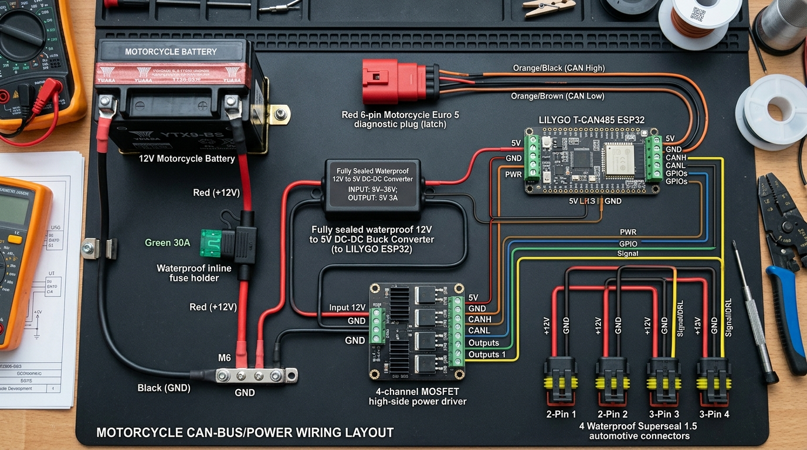
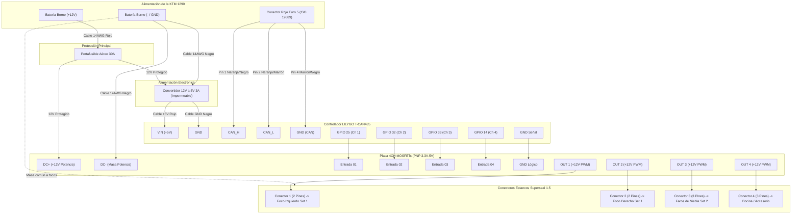

# ⚡ Esquema Eléctrico y Diagrama de Conexiones: KTM 1290 CANsmart

Guía técnica detallada para el conexionado de todos los componentes comprados en la **KTM 1290 Super Adventure S (2024 Euro 5)**.

---

## 🗺️ 1. Diagrama General de Conexiones (Esquema Visual)



> 📐 **Diagrama Vectorial SVG**: También tienes disponible el plano técnico vectorial de alta precisión en [hardware/ktm_wiring_schematic.svg](file:///c:/APPS-DEV/zzz/KTM-Bus/hardware/ktm_wiring_schematic.svg).

```
                            ┌──────────────────────────────────────────────┐
                            │      BATERÍA MOTO (12V BORNES DIRECTOS)      │
                            └──────┬────────────────────────────────┬──────┘
                   Positivo (+12V) │                                │ Negativo (GND / Masa)
                   Cable Rojo 14AWG│                                │ Cable Negro 14AWG
                                   ▼                                │
                        ┌─────────────────────┐                     │
                        │ PORTAFUSIBLE AÉREO  │                     │
                        │    FUSIBLE 30A      │                     │
                        └──────────┬──────────┘                     │
                                   │ +12V Protegido                 │
                                   ├────────────────────────────────┼────────────────────────┐
                                   │                                │                        │
                                   ▼                                ▼                        │
                 ┌──────────────────────────────────┐   ┌───────────────────────────┐        │
                 │   CONVERTIDOR DC-DC 12V A 5V     │   │   PLACA MOSFET POTENCIA   │        │
                 │  (Carcasa Sellada Impermeable)   │   │  (4CH PNP Input / Output) │        │
                 │                                  │   │                           │        │
                 │ IN (+): Cable Rojo 12V           │   │ DC+ (+12V): Cable 14AWG   │        │
                 │ IN (-): Cable Negro GND          │   │ DC- (GND) : Cable 14AWG   │        │
                 └─────────────────┬────────────────┘   └───────▲───────────┬───────┘        │
                                   │ 5V Estable                 │           │                │
                        ┌──────────┴──────────┐                 │ Señales   │ Salidas +12V   │
                   +5V  │ Cable Rojo          │ GND             │ PWM 3.3V  │ Hacia Luces    │
                        ▼                     ▼                 │           │                │
            ┌──────────────────────────────────────────────┐    │           │                │
            │           LILYGO T-CAN485 (ESP32)            │    │           │                │
            │                                              │    │           │                │
            │  [ALIMENTACIÓN]                              │    │           │                │
            │  VIN (Borna de tornillo) ◄── +5V Reducido    │    │           │                │
            │  GND (Borna de tornillo) ◄── Masa Convertidor│    │           │                │
            │                                              │    │           │                │
            │  [SEÑALES PWM - HEADER 12 PINES]             │    │           │                │
            │  GPIO 25 (Blanco)   ─────────────────────────┼────┘ 01 (Ch 1) │                │
            │  GPIO 32 (Amarillo) ─────────────────────────┼────┘ 02 (Ch 2) │                │
            │  GPIO 33 (Azul)     ─────────────────────────┼────┘ 03 (Ch 3) │                │
            │  GPIO 14 (Rojo)     ─────────────────────────┼────┘ 04 (Ch 4) │                │
            │  GND                ─────────────────────────┼────┘ GND Común │                │
            │                                              │                │                │
            │  [BORNERA CAN-BUS (LECTURA PASIVA 500k)]     │                │                │
            │  CAN_H (Borna) ◄── Pin 1 Euro 5 (Naranja/Neg)│                │                │
            │  CAN_L (Borna) ◄── Pin 2 Euro 5 (Naranja/Mar)│                │                │
            │  GND   (Borna) ◄── Pin 4 Euro 5 (Masa Chasis)│                │                │
            └──────────────────────────────────────────────┘                │                │
                                                                            │                │
                                       ┌────────────────────────────────────┘                │
                                       │                                                     │
                                       │    SALIDAS DE POTENCIA A CONECTORES SUPERSEAL       │
                                       │                                                     │
                                       ├─► OUT 1 (+12V PWM) ─┐                               │
                                       │   Conector 1 (2 pin) ├─► FOCO IZQUIERDO (SET 1)     │
                                       │   GND (Masa Común) ──┴──────────────────────────────┤
                                       │                                                     │
                                       ├─► OUT 2 (+12V PWM) ─┐                               │
                                       │   Conector 2 (2 pin) ├─► FOCO DERECHO (SET 1)       │
                                       │   GND (Masa Común) ──┴──────────────────────────────┤
                                       │                                                     │
                                       ├─► OUT 3 (+12V PWM) ─┐                               │
                                       │   Conector 3 (3 pin) ├─► FOCOS DE NIEBLA (SET 2)    │
                                       │   GND (Masa Común) ──┴──────────────────────────────┤
                                       │   (Pin 3 opcional: DRL o posición)                  │
                                       │                                                     │
                                       └─► OUT 4 (+12V PWM) ─┐                               │
                                           Conector 4 (3 pin) ├─► BOCINA / ACCESORIO / FRENO │
                                           GND (Masa Común) ──┴──────────────────────────────┘
                                           (Pin 3 opcional: luz de freno estrobo)
```

---

## 🔍 2. Diagrama de Flujo Lógico y Conexiones (Mermaid)



---

## 📋 3. Tabla de Conexionado Punto a Punto (Pinout Completo)

### Bloque A: Conector Rojo Euro 5 de la Moto (ISO 19689) ➔ LILYGO T-CAN485
El enchufe rojo bajo el asiento del pasajero:

| Pin Euro 5 Moto | Color Cable Original KTM | Destino en Placa LILYGO | Función |
| :---: | :---: | :---: | :--- |
| **Pin 1** | Naranja / Negro | **Borne CAN_H** | Línea de datos CAN High (500 kbps) |
| **Pin 2** | Naranja / Marrón | **Borne CAN_L** | Línea de datos CAN Low (500 kbps) |
| **Pin 4** | Marrón o Negro | **Borne GND** | Masa de referencia del bus CAN |
| *Pin 3* | *Rojo/Azul (+12V contacto)* | *(No conectar)* | *No se usa para evitar sobrecargar la instalación* |
| *Pin 5/6*| *Línea K-Line* | *(No conectar)* | *Diagnóstico antiguo no utilizado* |

---

### Bloque B: Alimentación de Batería y Convertidor 12V ➔ 5V

| Origen | Destino | Cable / Calibre | Descripción |
| :--- | :--- | :---: | :--- |
| **Batería Borne (+)** | Portafusible aéreo (Entrada) | AWG 14 Rojo (con anilla M6) | +12V directo permanente (KL30) |
| **Portafusible (Salida 30A)** | Placa MOSFET borna `DC+` | AWG 14 Rojo | Alimentación de potencia para focos |
| **Portafusible (Salida 30A)** | Convertidor DC-DC cable `IN (+)` | AWG 18-20 Rojo | Alimentación del reductor a 5V |
| **Batería Borne (-)** | Placa MOSFET borna `DC-` | AWG 14 Negro (con anilla M6) | Masa de potencia principal |
| **Batería Borne (-)** | Convertidor DC-DC cable `IN (-)` | AWG 18-20 Negro | Masa del reductor |
| **Convertidor Salida (+5V)** | Placa LILYGO borna `VIN` | AWG 20 Rojo (o USB-C) | 5V de alimentación limpia para ESP32 |
| **Convertidor Salida (GND)** | Placa LILYGO borna `GND` | AWG 20 Negro (o USB-C) | Masa común del ESP32 |

---

### Bloque C: Señales Lógicas ESP32 ➔ Placa de Potencia MOSFETs
Conexión desde el header de pines de la LILYGO hacia el lado de entrada de la placa amplificadora:

| Pin Header LILYGO | Borna Entrada Placa MOSFET | Canal de Software | Función Asignada en KTM |
| :---: | :---: | :---: | :--- |
| **GPIO 25** | Borna **01** | Canal 1 (Blanco) | Foco Izquierdo Set 1 (LEDC PWM 1 kHz) |
| **GPIO 32** | Borna **02** | Canal 2 (Amarillo) | Foco Derecho Set 1 (LEDC PWM 1 kHz) |
| **GPIO 33** | Borna **03** | Canal 3 (Azul) | Focos de Niebla Set 2 (LEDC PWM 1 kHz) |
| **GPIO 14** | Borna **04** | Canal 4 (Rojo) | Bocina / Accesorio conmutado |
| **GND** | Borna **GND / -** | Masa lógica | Referencia común de los optoacopladores |

---

### Bloque D: Placa MOSFETs (Salidas) ➔ Conectores Estancos de Luces

| Borna Salida MOSFET | Conector Superseal | Cable | Función en el Faro |
| :---: | :---: | :---: | :--- |
| **OUT 1** (+12V PWM) | **Conector 1** - Pin 1 | AWG 16 Rojo | Positivo Foco Izquierdo (Set 1) |
| **DC-** (Masa Batería) | **Conector 1** - Pin 2 | AWG 16 Negro | Masa Foco Izquierdo |
| **OUT 2** (+12V PWM) | **Conector 2** - Pin 1 | AWG 16 Rojo | Positivo Foco Derecho (Set 1) |
| **DC-** (Masa Batería) | **Conector 2** - Pin 2 | AWG 16 Negro | Masa Foco Derecho |
| **OUT 3** (+12V PWM) | **Conector 3** - Pin 1 | AWG 16 Rojo | Positivo Focos de Niebla (Set 2) |
| **DC-** (Masa Batería) | **Conector 3** - Pin 2 | AWG 16 Negro | Masa Focos de Niebla |
| *(Opcional / DRL)* | **Conector 3** - Pin 3 | AWG 18 Amarillo | Tercer cable DRL (si el foco tiene aro diurno) |
| **OUT 4** (+12V PWM) | **Conector 4** - Pin 1 | AWG 16 Rojo | Positivo Bocina / Accesorio / Luz Freno |
| **DC-** (Masa Batería) | **Conector 4** - Pin 2 | AWG 16 Negro | Masa Bocina / Accesorio |
| *(Opcional / Freno)* | **Conector 4** - Pin 3 | AWG 18 Verde | Tercer cable Señal de Freno estrobo / DWA (opcional) |

---

## ⚠️ 4. Reglas Críticas de Seguridad durante el Montaje

1. **Desconectar la Batería Primero:**
   * Quita siempre el borne **NEGATIVO (-)** de la batería de la moto antes de empezar a conectar cualquier cable.
2. **El Fusible de 30A se coloca al FINAL:**
   * Deja el portafusibles **abierto sin el fusible puesto** durante todo el montaje y soldadura. Solo inserta el fusible de 30A cuando todo el cableado esté revisado y verificado con multímetro.
3. **Escucha Pasiva del Bus CAN (Listen-Only):**
   * El firmware utiliza `TWAI_MODE_LISTEN_ONLY`. Tu placa solo "escucha" las tramas de la moto; no envía pulsos de ACK ni inyecta paquetes, protegiendo al 100% la ECU y el ABS de la 1290.
4. **Resistencia de 120Ω en la LILYGO:**
   * El bus CAN de la KTM ya tiene sus dos resistencias de terminación de 120Ω activas en la moto. Si la placa LILYGO trae un interruptor o puente etiquetado como `120R` o `R2`, **déjalo en OFF / Abierto** para no alterar la resistencia global del bus (que debe medir ~60Ω en reposo).
5. **Aislamiento en Caja IP65:**
   * Fija la placa LILYGO y la placa MOSFET dentro de la caja con separadores de plástico o cinta de espuma de doble cara para evitar que las soldaduras toquen entre sí con las vibraciones.
